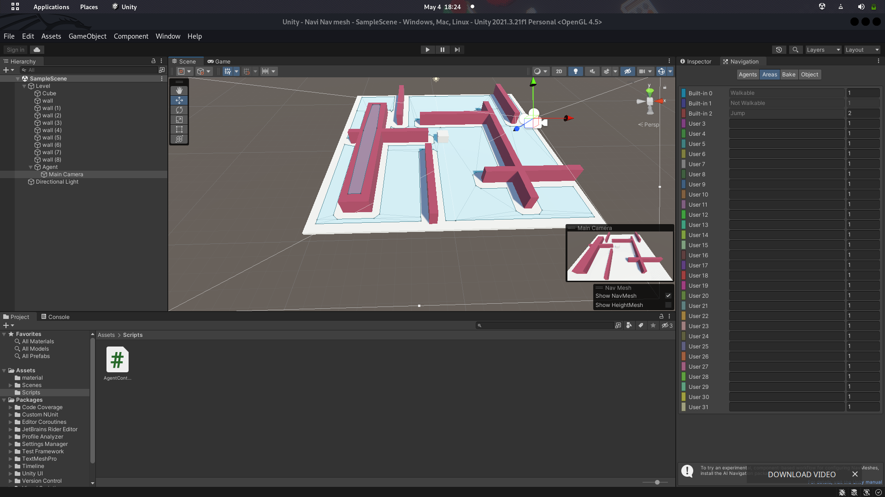

# Introduction Ai npc movement

-  I itereated from using the hit variable of type RaycastHit in our first script clickmove.cs to create a player click function #which instructs our player Agent on where to move.Moved to creating a steer path powered agent which is able to follow a given path, this is all possible because of one of our linear interpolation technique (Slerp [Spherical Linear intERPolation])

#Credit 

Beginning Game AI with Unity

# Screenshots
[aivv.webm](https://github.com/Thabisocn/intro-unity-ai-/assets/55186310/b0650334-d97d-41cf-8fb0-c2c87c460d26)

# Path(Breadth first search)

- Breadth first search algorithm was used together with a waypoint system to create a path system. The navigation  wasnt smooth because of the waypoint system navigation to optimise our agent's movement we used Navmesh with A* search algorithm 

# A* + Nav mesh
[Screencast from 2023-05-04 18-54-52.webm](https://github.com/Thabisocn/intro-unity-ai-/assets/55186310/5a64f39d-3545-4fb1-b931-16c9827e3e80)

- Path navigation optimised with Navigation mesh and A* search algorithm

# A* || Nav mesh || Finite state machines
[Screencast from 2023-05-08 19-25-30.webm](https://github.com/Thabisocn/intro-unity-ai-/assets/55186310/08b3c63a-052f-41a5-8bac-c13c2c3be326)

- Using FSM i created a Guard agent with 3 states  

* patrol
* investigate
* chase

Our guard navigates our plane using The navmesh and navmesh agent we talked about above.We gave our guard sense of seeing by using Field of view (FOV)  so he can track the player.

- Since its Guard against player Our player can trigger a Guard Investigation by knocking which changes our  guards state from patrol to investgate where the sound comes from .

# AI movement

