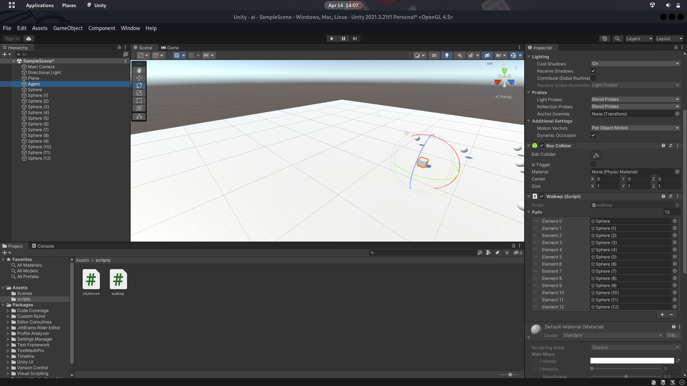

aivv.webm

# Introduction Ai npc movement

-  I itereated from using the hit variable of type RaycastHit in our first script clickmove.cs to create a player click function #which instructs our player Agent on where to move.Moved to creating a steer path powered agent which is able to follow a given path, this is all possible because of one of our linear interpolation technique (Slerp [Spherical Linear intERPolation])

#Credit 

Beginning Game AI with Unity

# Screenshots

